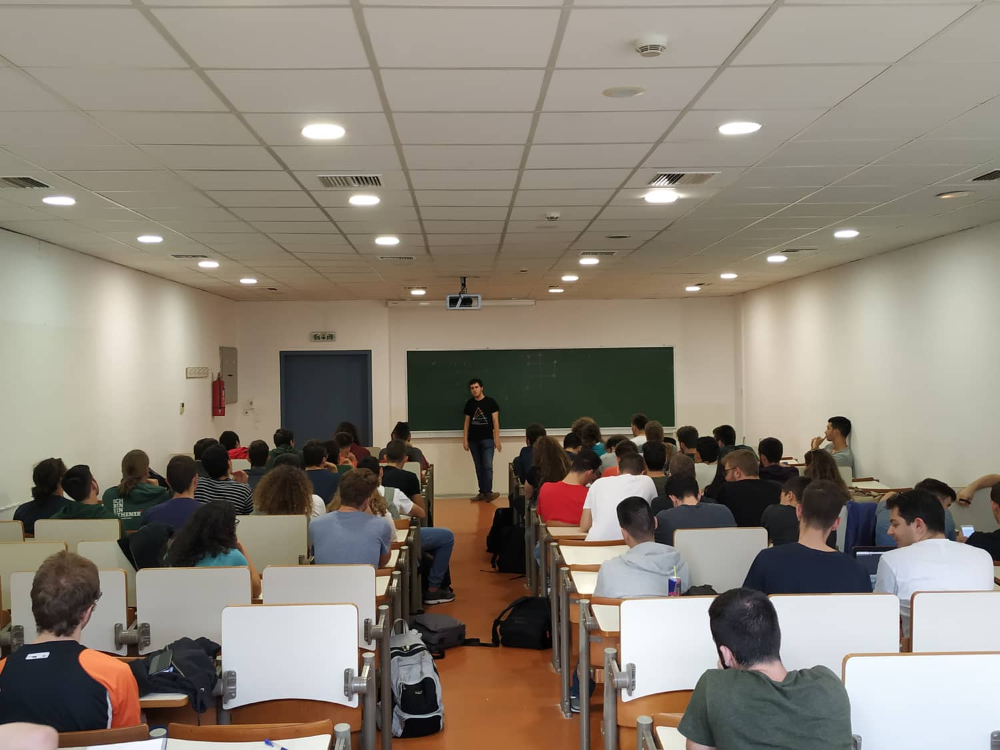

On the 25th of May 2018 me and [Miltiadis Stouras](https://github.com/mstou)
founded [Algoholics](https://github.com/algoholics-ntua). 
Algoholics is a peer to peer colaborative group for
spreading Computer Science knowledge and literature across the country.

It all started with the idea of providing an open platform where anyone could
present anything they learn. Doing this they could get a better grasp of the
topic they are learning about and educate their fellow students all at once.

Since the inception of Algoholics we have conducted over 50
get-togethers/presentations with topics ranging from Algorithms, Machine
Learning, Competitive Programming, Quantum Computing, Number Theory, Combinatorics and the list
keeps getting bigger and bigger.

At the moment we have over 1.2K members on our [Algoholics Facebook
Page](https://www.facebook.com/groups/2093168194256744) from universities all
over the country.

We are aiming at making Algoholics the best version of what it already is. A lively and
supporting community where everyone can creatively express themselves through
science.

You can access our Open Source Projects and the lecture notes from our meetups 
through our [Github Page](https://github.com/algoholics-ntua). Join our [Facebook
Community](https://www.facebook.com/groups/2093168194256744/) to get
to know us and of course subscribe on our [Youtube
Channel](https://www.youtube.com/channel/UCVhaU_PzGJpeVWQrAT8_LeQ).
